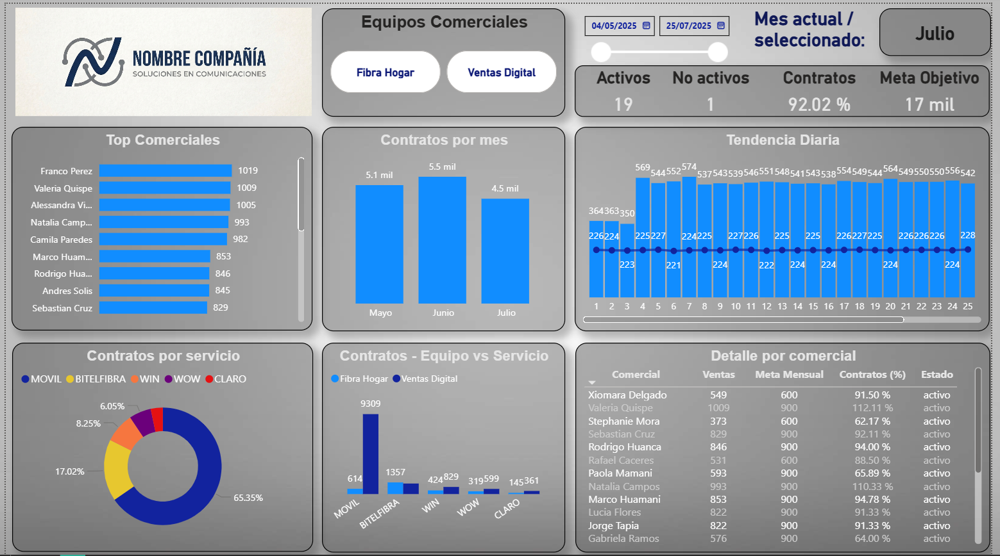

# DataMart de Rendimiento Comercial

Sistema de Business Intelligence para el seguimiento de rendimiento 
de equipos comerciales en empresa de telecomunicaciones, Lima 2024.

## 🏗️ Arquitectura del Pipeline
```
Google Sheets (captura de ventas)
        ↓ Apps Script
CSV diario
        ↓ SQL Agent Job (cada 5 min)
BD Transaccional (SQL Server)
        ↓ SSIS ETL (ODS → STG → BDS)
DataMart (SQL Server)
        ↓
Power BI Dashboard
```

## 📊 Dashboard



## 🛠️ Stack Tecnológico

- **SQL Server** → Base de datos transaccional y DataMart
- **SSIS** → Pipeline ETL en 3 capas (ODS, STG, BDS)
- **SQL Agent** → Automatización de carga cada 5 minutos
- **Power BI** → Dashboard interactivo
- **Google Sheets + Apps Script** → Captura de ventas (no disponible — cuenta corporativa)
- **Script .bat** → Orquestador del pipeline

## 📁 Estructura del Proyecto
```
datamart-rendimiento-comercial/
│
├── source/          → Proyecto SSIS (Visual Studio)
├── scripts/         → Scripts SQL y pipeline .bat
├── dashboard/       → Reporte Power BI (.pbix)
├── data/            → Dataset de muestra (ventas_sample.csv)
└── dashboard_preview.png
```

## ⚙️ Scripts SQL

| Archivo | Descripción |
|---|---|
| `t01_carga_flujo_datamart.sql` | Job ETL — orquesta capas ODS, STG y BDS |
| `t02_carga_ventas_job.sql` | Job de carga automática del CSV cada 5 min |
| `s01_queries_bd_transaccional.sql` | Queries de la BD transaccional |
| `s02_queries_datamart.sql` | Queries del DataMart |
| `pipeline.bat` | Script de transferencia de archivos |

## ⚠️ Notas

- Los datos en `ventas_sample.csv` son ficticios — replican la estructura real
- El dashboard está conectado al CSV para demostración. En producción la fuente es SQL Server
- Los scripts de conexión usan `NOMBRE_SERVIDOR` como placeholder
- Apps Script no disponible por haber sido desarrollado en cuenta corporativa

## 👤 Autor

**Herles Daniel Lopez Bancho**
Data Analyst BI | Estudiante Ing. de Sistemas
[LinkedIn](https://linkedin.com/in/daniel-lopez-572680194)
